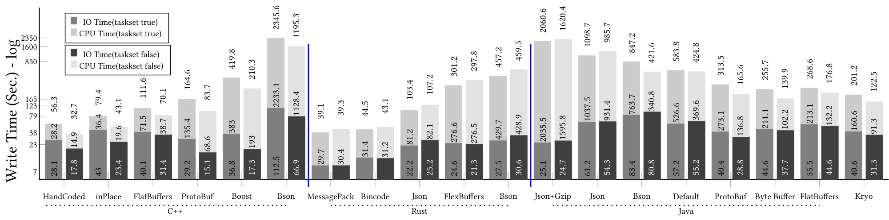

<!-- Short description -->
<p align="center">
   Understanding Performance Implications of Complex Objects Implementations for Big Data Systems
</p>

<!-- Draw horizontal rule -->
<hr>


<!-- Table of content -->
|Section|Description| 
| --- |---|
| [Installation](#installation) | Installing the dependencies. Tested Versions:  C++( [clang v6.0](https://releases.llvm.org/6.0.0/tools/clang/docs/ReleaseNotes.html), [Boost v1_75](https://dl.bintray.com/boostorg/release/1.75.0/source/boost_1_75_0.tar.bz2), [Google Protobuf v3.11.0](https://github.com/protocolbuffers/protobuf/releases/tag/v3.11.0), [Mongo-c-driver 1.16.2](https://github.com/mongodb/mongo-c-driver/releases/tag/1.16.2), [MongoDB C++11 Driver r3.4.2](https://github.com/mongodb/mongo-cxx-driver/releases/tag/r3.4.2)) <br> Java [SE 8u241](https://www.oracle.com/java/technologies/javase-downloads.html) <br> Rust & Cargo [1.43](https://www.rust-lang.org/tools/install) |
| [Getting started](#getting-started) | A quick introduction on how to run benchmarks |
| [Experimental Results](#experimental_results) | An extensive overview of experimental results|
| [Citation](#referencing-tslearn) | A citation for scholarly articles |


## Installation
Our implementation has been compiled, built, and tested in Ubuntu 18.04 LTS. For the system to work properly, make sure the following requirements are satisfied.
### 1. C++
#### 1.1. Install C++ :
* Clang and clang++ version 6.0: `$sudo apt-get install clang`

#### 1.2. Install ubuntu rapid json:
* Rapid-json: `$ sudo apt-get install rapidjson-dev` 
#### 1.3. Install libboost:
* Download last version of `Boost` [`https://www.boost.org/users/download/`](https://www.boost.org/users/download/)
* Steps for install from source(`tested version 1_75`):
   ```bash 
     $ tar -xf boost_1_72_0.tar.bz2 
     $ cd boost_1_72_0
     $ ./bootstrap.sh --prefix=/usr/
     $ ./b2
     $ sudo ./b2 install
  ```
#### 1.4. Install google protobuf:
To build protobuf from source, the following tools are needed:
* autoconf
* automake
* libtool
* make
* g++
* unzip

On Ubuntu/Debian, you can install them with:
```bash 
$ sudo apt-get install autoconf automake libtool curl make g++ unzip
```
To get the source, download one of the release .tar.gz or .zip packages in the release page:
(download `.cpp` version)

[`https://github.com/protocolbuffers/protobuf/releases/tag/v3.11.0`](https://github.com/protocolbuffers/protobuf/releases/tag/v3.11.0)


To build and install the C++ Protocol Buffer runtime and the Protocol Buffer compiler (protoc) execute the following:

Extract `.tar.gz` file and cd to source folder:
```bash 
    $ ./configure
    $ make
    $ make check
    $ sudo make install
    $ sudo ldconfig # refresh shared library cache.
```

#### 1.5. Install C++ BSON:
The official url for install `MongoDB` driver available at [`http://mongocxx.org/mongocxx-v3/installation/`](http://mongocxx.org/mongocxx-v3/installation/)

* Step 1: Install the latest version of the `MongoDB C` driver:
    - You will need to download and build from the source code. Get a tarball from the C Driver releases page.
     [`https://github.com/mongodb/mongo-c-driver/releases/tag/1.16.2`](https://github.com/mongodb/mongo-c-driver/releases/tag/1.16.2)
    - Follow the instructions for building from a tarball at Installing `libmongoc`.
      ```bash
      $ tar xzf mongo-c-driver-x.y.z.tar.gz
      $ cd mongo-c-driver-x.y.z
      $ mkdir cmake-build
      $ cd cmake-build
      $ cmake -DENABLE_AUTOMATIC_INIT_AND_CLEANUP=OFF ..
      $ sudo make install
      ```
* Step 2: Download the latest version of the `mongocxx` driver:
    - Download source:[`https://github.com/mongodb/mongo-cxx-driver/releases/tag/r3.4.2`](https://github.com/mongodb/mongo-cxx-driver/releases/tag/r3.4.2) 
    - Extract the source and goto to the build path:
        ```bash
        $ tar -xzf r3.4.2.tar.gz
        $ cd mongo-cxx-driver-r3.4.1/build
        ```
* Step 3: Configure the driver:
    * On Unix systems, `libmongoc` installs into `/usr/local` by default. Without additional configuration, `mongocxx` installs into its local build directory as a courtesy to those who build from source. To configure `mongocxx` for installation into `/usr/local` as well, use the following cmake command:
        ```bash
        $ cmake ..                                \
            -DCMAKE_BUILD_TYPE=Release          \
            -DCMAKE_INSTALL_PREFIX=/usr/local
        ``` 
* Step 4: Build and install the driver:
    ```bash
    $ make && sudo make install
    ```
### 2. Java
#### 2.1 install Maven
* `$ sudo apt-get install maven`
    
#### 2.2 install JDK(1.8)
* Download Java SE 8u241 [`https://www.oracle.com/java/technologies/javase-downloads.html`](https://www.oracle.com/java/technologies/javase-downloads.html)
 
* Extract and move Java source:
    * Extract: `$ tar -xvf jdk-8u241-linux-x64.tar.gz`
    * Move: `$ sudo mv jdk1.8.0_241/ /usr/lib/jvm/`

* Install JDK 1.8:
    -     $ sudo update-alternatives --install "/usr/bin/java" "java" "/usr/lib/jvm/jdk1.8.0_241/bin/java" 1
          $ sudo update-alternatives --install "/usr/bin/javac" "javac" "/usr/lib/jvm/jdk1.8.0_241/bin/javac" 1
          $ sudo update-alternatives --install "/usr/bin/javaws" "javaws" "/usr/lib/jvm/jdk1.8.0_241/bin/javaws" 1


* Set JDK 1.8 as a default:
    * Choices a number for the alternative java: `$ sudo update-alternatives --config java`
    * Add to ```.bashrc``` file: `$ sudo nano ~/.bashrc`
    * Add bellow texts to the  ```.bashrc``` file:
        
            JAVA_HOME=/usr/lib/jvm/jdk1.8.0_241
            PATH=$PATH:$HOME/bin:$JAVA_HOME/bin
            export JAVA_HOME
            export JRE_HOME
            export PATH
    * Submit changes: `$ source ~/.bashrc`

* Test current Java version: `$ sudo java -version`
    * result:
    -       java version "1.8.0_241"
            Java(TM) SE Runtime Environment (build 1.8.0_241-b07)
            Java HotSpot(TM) 64-Bit Server VM (build 25.241-b07, mixed mode)


### 3. Rust
* Install the `Rust` and `Cargo` follow this link: [`https://www.rust-lang.org/tools/install`](https://www.rust-lang.org/tools/install)
    
## Getting started

#### 1. Download `Twitter` dataset:
A sample of `Twitter` dataset available in bellow link. This data is in text format and each line is a complete tweet in json format:

* Data Link: [`https://metcs777.s3.amazonaws.com/tweets_1M_rows.txt.bz2`](https://metcs777.s3.amazonaws.com/tweets_1M_rows.txt.bz2)

####  2. Compile the project:
There is a bash script in each subdirectories `C++`, `Java`, and `Rust`. Run the related bash script for compile the project:
* C++:`$ ./C++/makeClean.sh`
* Java:`$ ./Java/makeClean.sh`
* Rust:`$ ./Rust/makeClean.sh` 
 
## Experimental Results
####  1. Write object experiments:
This experiment include sequential write serialized objects.  One round of this experimentation need for next `Read Experiments`. We run all of our experiments 3 times and observed that the results have low variance. Run this script for write objects:
* C++: `$ ./C++/twitterSerialization.sh {path/to/data} {path/to/out/} {number/of/tweets/want/to/serialize}`
* Java: `$ ./Java/twitterSerialization.sh {path/to/data} {path/to/out/} {number/of/tweets/want/to/serialize}`
* Rust: `$ ./Rust/twitterSerialization.sh {path/to/data} {path/to/out/} {number/of/tweets/want/to/serialize}` 

Example:
```bash
$ ./C++/twitterSerialization.sh /mnt/tweets_1M_rows.txt /mnt/cppdata 1000
```
The content of `twitterSerialization.sh` is:
* C++:
```
for r in 1 2 3
 do
   for serialization_type in   1 2 3 4 5 6
    do
         outpath="serialization_$serialization_type.se"
         #clear the OS cache
         echo 3 > /proc/sys/vm/drop_caches && sync
                        
         #Run normal experiment 
         time ./bin/TwitterSerialization $datapath $serialization_type $outpath $numberOfTweets $r 0
             
         # wait a short time for back to stable state
         sleep 200
                
         #clear the OS cache
         echo 3 > /proc/sys/vm/drop_caches && sync
                       
         # Run the experiment just on Core 0
         time taskset -c 0 ./bin/TwitterSerialization $datapath $serialization_type $outpath $numberOfTweets $r 1
    done
 done
```
* Java: set `-XmsXg` `-XmxXg` based on your system configuration
```
for r in 1 2 3
  do
    for serialization_type in   1 2 3 4 5 6 7 8
      do
        outpath="serialization_$serialization_type.se"
        #clear the OS cache
        echo 3 > /proc/sys/vm/drop_caches && sync
                    
        #Run normal experiment 
        time java   -XX:-UseGCOverheadLimit -XX:+UseConcMarkSweepGC -Xms4g -Xmx7g -cp  ./target/Twitter-1.0-SNAPSHOT-jar-with-dependencies.jar edu.bu.benchmarks.DataSerialization $datapath $serialization_type $outpath $numberOfTweets $r false
                    
        # wait a short time for back to stable state
        sleep 200
            
        #clear the OS cache
        echo 3 > /proc/sys/vm/drop_caches && sync
                   
        # Run the experiment just on Core 0
        time taskset -c 0 java   -XX:-UseGCOverheadLimit -XX:+UseConcMarkSweepGC -Xms4g -Xmx7g -cp  ./target/Twitter-1.0-SNAPSHOT-jar-with-dependencies.jar edu.bu.benchmarks.DataSerialization $datapath $serialization_type $outpath $numberOfTweets $r true
        done
  done 
```
* Rust:
```
for r in 1 2 3
  do
     for serialization_type in   1 2 3 4 5
       do
        outpath="serialization_$serialization_type.se"
        #clear the OS cache
        echo 3 > /proc/sys/vm/drop_caches && sync
                    
        #Run normal experiment 
        time cargo run --release write  $datapath $serialization_type $outpath $numberOfTweets $r false
                    
        # wait a short time for back to stable state
        sleep 200
            
        #clear the OS cache
        echo 3 > /proc/sys/vm/drop_caches && sync
                   
        # Run the experiment just on Core 0
        time taskset -c 0 cargo run --release write  $datapath $serialization_type $outpath $numberOfTweets $r true
        done
  done
```
After finish the serialization task in the out path(the second parameter) you can see the following files:

| # |C++|Java |Rust|
|---|--- |---|---|
|1|`HandCoded` <br> `serialization_1.[se, se.index]`|`Default` <br> `serialization_1.[se, se.index]`|`Json ` <br> `serialization_1.[se, se.index]`|
|2|`InPlace` <br> `serialization_2.[se, se.index]`|`Json+Gzip` <br> `serialization_2.[se, se.index]`|`Bincode` <br> `serialization_2.[se, se.index]`|
|3|`Boost` <br> `serialization_3.[se, se.index]`|`Bson` <br> `serialization_3.[se, se.index]`|`MessagePack` <br> `serialization_3.[se, se.index]`|
|4|`ProtoBuf`<br> `serialization_4.[se, se.index]` |`ProtoBuf` <br> `serialization_4.[se, se.index]`|`Bson` <br> `serialization_4.[se, se.index]`|
|5|`BSON` <br> `serialization_5.[se, se.index]`|`Kryo` <br> `serialization_5.[se, se.index]`|`FlexBuffers` <br> `serialization_5.[se, se.index]`|
|6|`FlatBuffers` <br> `serialization_6.[se, se.index]` |`Byte Buffer` <br> `serialization_6.[se, se.index]`|---|
|7|--- |`FlatBuffers` <br> `serialization_7.[se, se.index]`|---|
|8|--- |`Json` <br> `serialization_8.[se, se.index]`|---|

The experiment was based on 5 million data.The final log file results for write objects experiment available at the related path:
```bash
{project/path}/bin/benchmark/writeobjects
```
Example of files:
```bash
result_java_writeobjects_5000000_1.txt
result_java_writeobjects_5000000_2.txt
result_java_writeobjects_5000000_3.txt
```

Example of result content:
```bash
language#taskset#method#seq#datatype#iotime#totaltime
[WriteTimeJAVA]#false#Java Default#true#TweetStatus#46.533803422#402.846320084
[WriteTimeJAVA]#true#Java Default#true#TweetStatus#57.150347609#548.940365011
[WriteTimeJAVA]#false#Java Json+Gzip#true#TweetStatus#17.098395421#1589.679004718
[WriteTimeJAVA]#true#Java Json+Gzip#true#TweetStatus#28.520531689#2014.750860796
...
[WriteTimeJAVA]#false#Java FlatBuffers#true#TweetStatus#45.86361197#171.276057655
[WriteTimeJAVA]#true#Java FlatBuffers#true#TweetStatus#53.48092523#254.482728354
```

The table below present the all of the experiments results for 5 million Tweet objects(the data based on `Second` timestamp).

<table>  
  <tr>
    <td rowspan="3">Method</td>
    <td colspan="2">IO</td>
    <td colspan="2">Total(CPU+IO)</td>    
  </tr> 

  <tr>  
    <td colspan="2">Mean(SD)</td>
    <td colspan="2">Mean(SD)</td>    
  </tr>  
  <tr>
    <td >TS=True</td>
    <td >TS=False</td>
    <td >TS=True</td>
    <td >TS=False</td>   
  </tr>   
  <tr><td>Java Default</td><td>57.22(10.24)</td><td>55.2(15.61)</td><td>583.85(30.24)</td><td>424.78(19)</td></tr>
  <tr><td>Java Json+Gzip</td><td>25.11(3.03)</td><td>24.65(10.12)</td><td>2060.56(64.51)</td><td>1620.41(48.84)</td></tr>
  <tr><td>Java Bson</td><td>83.42(3)</td><td>80.77(8.55)</td><td>847.16(57.89)</td><td>421.62(18.39)</td></tr>
  <tr><td>Java ProtoBuf</td><td>40.38(4.4)</td><td>28.81(4.24)</td><td>313.46(14.86)</td><td>165.59(11.57)</td></tr>
  <tr><td>Java Kryo</td><td>40.58(5.59)</td><td>31.27(4.5)</td><td>201.17(24.3)</td><td>122.54(4.84)</td></tr>
  <tr><td>Java Byte Buffer</td><td>44.63(3.82)</td><td>37.75(2.64)</td><td>255.73(18.48)</td><td>139.94(6.06)</td></tr>
  <tr><td>Java FlatBuffers</td><td>55.49(4.66)</td><td>44.62(1.46)</td><td>268.64(22.31)</td><td>176.81(5.38)</td></tr>
  <tr><td>Java Json</td><td>61.19(4.59)</td><td>54.28(5.36)</td><td>1098.67(22.31)</td><td>985.71(12.14)</td></tr>
  <tr><td>C++ HandCoded</td><td>28.12(5.71)</td><td>17.79(6.61)</td><td>56.32(6.11)</td><td>32.69(6.69)</td></tr>
  <tr><td>C++ inPlace</td><td>42.99(4.66)</td><td>23.45(7.2)</td><td>79.36(5)</td><td>43.1(8.19)</td></tr>
  <tr><td>C++ Boost</td><td>36.8(1.47)</td><td>17.35(3.67)</td><td>419.8(4.12)</td><td>210.31(7.3)</td></tr>
  <tr><td>C++ ProtoBuf</td><td>29.24(5.94)</td><td>15.13(3.24)</td><td>164.62(6.74)</td><td>83.69(4.56)</td></tr>
  <tr><td>C++ Bson</td><td>112.52(26.2)</td><td>66.91(10.83)</td><td>2345.63(28)</td><td>1195.31(12.21)</td></tr>
  <tr><td>C++ FlatBuffers</td><td>40.07(6.13)</td><td>31.38(3.89)</td><td>111.62(6.16)</td><td>70.09(5.03)</td></tr>
  <tr><td>Rust Json</td><td>22.17(1.65)</td><td>25.15(5.28)</td><td>103.41(2.39)</td><td>107.21(6.28)</td></tr>
  <tr><td>Rust Bincode</td><td>13.09(2.14)</td><td>11.93(1.49)</td><td>44.51(2.28)</td><td>43.11(1.76)</td></tr>
  <tr><td>Rust MessagePack</td><td>9.34(1.23)</td><td>8.89(1.08)</td><td>39.06(1.36)</td><td>39.29(1.67)</td></tr>
  <tr><td>Rust Bson</td><td>27.5(3.59)</td><td>30.62(8.99)</td><td>457.23(3.63)</td><td>459.53(10.07)</td></tr>
  <tr><td>Rust FlexBuffers</td><td>24.56(3.36)</td><td>21.35(3.65)</td><td>301.21(4)</td><td>297.82(2.22)</td></tr>
</table>



####  1. Read object experiments:
This experiment include sequential and random read serialized objects,
so make sure generated enough list of objects in the [Write object experiments](####1.Write object experiments). 
For random read, before run the experiment we need to generate random lists and
save it in a text files. For generate random list you can run this script at C++ directory:
```bash
$ cd C++/                       
$ ./twitterGenerateRandomList.sh {maximum/value/in/list} {number/of/random/data} {out/path}
```
Example: `$ ./twitterGenerateRandomList.sh 1000 100 /mnt/randomlist`

In this example 100 random numbers from 0 to maximum number 1000 created at `/mnt/randomlist/randomlist_100.txt`
 
We run all of our experiments 3 times and observed that the results have low variance.
Run this script for read objects. This script include both sequential and random read:

C++: `$ sudo ./experimentReadObjects.sh {path/to/serialized/data} {path/to/randomlist}`

Java: `$ sudo ./experimentReadObjects.sh {path/to/serialized/data} {path/to/randomlist}`

Rust: `$ sudo ./experimentReadObjects.sh {path/to/serialized/data} {path/to/randomlist}`

Example: `$ sudo ./experimentReadObjects.sh /mnt/serialized_data/cppdata1000 /mnt/randomlist`


The contect of "experimentReadObjects.sh" is here:

* C++ :
```bash
for r in 1 2 3
do
    # for serialization types:
    for i in 1 2 3 4 5
    do
        #for number of objects:
        for n in  1000000 2000000 3000000 4000000 5000000
        do
        ./twitterSequentialRead.sh $i $n $r $data_path
         
         sleep 200

        ./twitterRandomRead.sh $i $n $r $data_path $random_list_path

        done
    done
done
```
* Java:
```bash
for r in 1 2 3 
do
    # for serialization types:
    for i in 1 2 3 4 5 6
    do
        #for number of objects:
        for n in  1000000 2000000 3000000 4000000 
        do
        ./twitterSequentialRead.sh $i $n $r $data_path
        
         sleep 200

        ./twitterRandomRead.sh $i $n $r $data_path $random_list_path

        done
    done
done
```
* Rust:
```bash
for r in 1 2 3
do
    # for serialization types:
    for i in 1 2 3 4 5
    do
        #for number of objects:
        for n in  1000000 2000000 3000000 4000000 5000000
        do
        ./twitterSequentialRead.sh $i $n $r $data_path
        
        sleep 200
        
        ./twitterRandomRead.sh $i $n $r $data_path $random_list_path
        
        done
    done
done
```

The experiment prepared for 1 to 5 millions data, so if you want to change number of read objects 
just change the values of inner for loop.

Finally, the final log file results for read object experiment available in this path:
```bash
{project/path}/bin/benchmark/readobjects
```
example of files :
```bash
result_java_readobjects_1000_1.txt
result_java_readobjects_1000_2.txt
result_java_readobjects_1000_3.txt
```
example of result content:
```bash
language#taskset#method#seq#datatype#iotime#totaltime
[ReadTimeJAVA]#true#Java Default#true#TweetStatus#23.798836036#352.906722848
[ReadTimeJAVA]#false#Java Default#true#TweetStatus#18.159668422#165.313603375
[ReadTimeJAVA]#true#Java Default#false#TweetStatus#1572.860794899#1921.952341106
[ReadTimeJAVA]#false#Java Default#false#TweetStatus#1546.022621157#1708.930474179
...
[ReadTimeJAVA]#true#Java FlatBuffers#true#TweetStatus#12.389147518#27.126166431
[ReadTimeJAVA]#false#Java FlatBuffers#true#TweetStatus#12.793152134#20.527560654
[ReadTimeJAVA]#true#Java FlatBuffers#false#TweetStatus#960.76642819#980.017399323
[ReadTimeJAVA]#false#Java FlatBuffers#false#TweetStatus#936.032555176#947.904076846
```


<table>  
  <tr>
    <td rowspan="4">Method</td>
    <td colspan="4">Sequential(sec.)</td>
    <td colspan="4">Random(min.)</td>    
  </tr>
  
  <tr>
      <td colspan="2">IO</td>
      <td colspan="2">Total(CPU+IO)</td>
      <td colspan="2">IO</td>
      <td colspan="2">Total(CPU+IO)</td>    
    </tr> 
 

  <tr>  
    <td colspan="2">Mean(SD)</td>
    <td colspan="2">Mean(SD)</td>
    <td colspan="2">Mean(SD)</td>
    <td colspan="2">Mean(SD)</td>    
  </tr>  
  <tr>
    <td >TS=True</td>
    <td >TS=False</td>
    <td >TS=True</td>
    <td >TS=False</td>
    <td >TS=True</td>
    <td >TS=False</td>
    <td >TS=True</td>
    <td >TS=False</td>   
  </tr>   
 <tr><td>Java Default</td><td>122.96(5.46)</td><td>78.28(1.81)</td><td>1548.11(21.52)</td><td>662.97(6.51)</td><td>395.22(11.51)</td><td>401.3(5.71)</td><td>423.29(12.01)</td><td>415.46(5.96)</td></tr>
 <tr><td>Java Json+Gzip</td><td>43.91(1.63)</td><td>14.81(0.75)</td><td>1451.71(11.39)</td><td>612.98(8.99)</td><td>62.39(1.45)</td><td>70.83(2.28)</td><td>86.7(1.85)</td><td>82.05(2.17)</td></tr>
 <tr><td>Java Bson</td><td>181.96(10.69)</td><td>87.08(13.55)</td><td>1137.91(120.32)</td><td>391.34(39.95)</td><td>433.05(9.05)</td><td>444.24(15.2)</td><td>451(10.89)</td><td>451.34(15.5)</td></tr>
 <tr><td>Java ProtoBuf</td><td>72.73(2.13)</td><td>30.44(3.03)</td><td>426.09(45.21)</td><td>152.15(13.3)</td><td>94.98(2.61)</td><td>100.39(2.85)</td><td>101.65(3.27)</td><td>103.13(3.11)</td></tr>
 <tr><td>Java Kryo</td><td>67.9(1.81)</td><td>27.11(0.74)</td><td>397.18(34.18)</td><td>157.81(11)</td><td>108.59(1.52)</td><td>116.19(3.61)</td><td>114.94(2.25)</td><td>119.1(3.87)</td></tr>
 <tr><td>Java Byte Buffer</td><td>86.62(3.24)</td><td>38.55(1.54)</td><td>512.83(28.85)</td><td>269.8(11.18)</td><td>213.55(7.12)</td><td>229.08(12.06)</td><td>221.55(7.75)</td><td>234.2(12.99)</td></tr>
 <tr><td>Java FlatBuffers</td><td>52.69(5.01)</td><td>52.71(1.89)</td><td>115.3(15.95)</td><td>85.44(4.34)</td><td>19.08(0.83)</td><td>18.61(0.44)</td><td>20.49(1.04)</td><td>19.45(0.55)</td></tr>
 <tr><td>Java Json</td><td>172.95(6.71)</td><td>34.63(2.04)</td><td>1132.99(14.96)</td><td>453.16(2.18)</td><td>484.67(13.86)</td><td>493.57(25.01)</td><td>504.47(13.41)</td><td>504.74(25.24)</td></tr>
 <tr><td>C++ HandCoded</td><td>38.53(4.95)</td><td>36.76(3.06)</td><td>63.2(5.41)</td><td>67.14(2.29)</td><td>20.57(0.9)</td><td>20.97(1.47)</td><td>21.36(0.9)</td><td>21.86(1.48)</td></tr>
 <tr><td>C++ inPlace</td><td>92.71(8.09)</td><td>90.48(10.89)</td><td>93.1(8.1)</td><td>90.86(10.9)</td><td>32.55(2.63)</td><td>32.9(2.23)</td><td>32.62(2.63)</td><td>32.97(2.23)</td></tr>
 <tr><td>C++ Boost</td><td>14.88(1.14)</td><td>15.75(0.43)</td><td>175.02(3.6)</td><td>181.4(1.35)</td><td>22.23(1.12)</td><td>22.49(1.16)</td><td>25.42(1.12)</td><td>25.77(1.12)</td></tr>
 <tr><td>C++ ProtoBuf</td><td>18.79(4.35)</td><td>17.94(1.82)</td><td>70.04(2.63)</td><td>79.04(0.22)</td><td>28.94(2.02)</td><td>29.01(2.4)</td><td>30.22(2.05)</td><td>30.31(2.42)</td></tr>
 <tr><td>C++ Bson</td><td>40.91(3.02)</td><td>41.03(3.29)</td><td>1116.96(9.5)</td><td>1120(13.17)</td><td>725.88(69.52)</td><td>719.93(74.02)</td><td>746.52(69.53)</td><td>740.77(74.3)</td></tr>
 <tr><td>C++ FlatBuffers</td><td>67.63(7.07)</td><td>64.5(6.5)</td><td>89.31(9.11)</td><td>87.93(7.01)</td><td>50.7(3.23)</td><td>50.32(5.02)</td><td>51.34(3.27)</td><td>50.95(5.08)</td></tr>
 <tr><td>Rust Json</td><td>224.84(24.76)</td><td>215.98(38.89)</td><td>436.46(25.43)</td><td>423.07(31.01)</td><td>509.54(228.31)</td><td>516.29(229.4)</td><td>516.29(228.46)</td><td>522.92(229.57)</td></tr>
 <tr><td>Rust Bincode</td><td>152.01(17.45)</td><td>144.89(10.93)</td><td>272.7(23.89)</td><td>252.76(5.83)</td><td>84.72(37.83)</td><td>84.7(35.64)</td><td>87.42(37.6)</td><td>87.32(35.44)</td></tr>
 <tr><td>Rust MessagePack</td><td>130.49(9.95)</td><td>124.39(8.02)</td><td>258.71(9.4)</td><td>241.93(1.22)</td><td>27.38(10.98)</td><td>27.5(11.78)</td><td>30.03(10.66)</td><td>30.04(11.69)</td></tr>
 <tr><td>Rust Bson</td><td>180.13(55.89)</td><td>168.19(41.99)</td><td>821.09(59.39)</td><td>804.26(55.99)</td><td>955.26(412.97)</td><td>1216.95(61.1)</td><td>972.42(413.53)</td><td>1234.57(61.48)</td></tr>
 <tr><td>Rust FlexBuffers</td><td>185.32(39.48)</td><td>177.2(34.77)</td><td>400.33(34.96)</td><td>389.32(37.78)</td><td>405.54(158.34)</td><td>402.16(148.79)</td><td>411.42(158.56)</td><td>408(149.06)</td></tr>
</table>

## Citation

